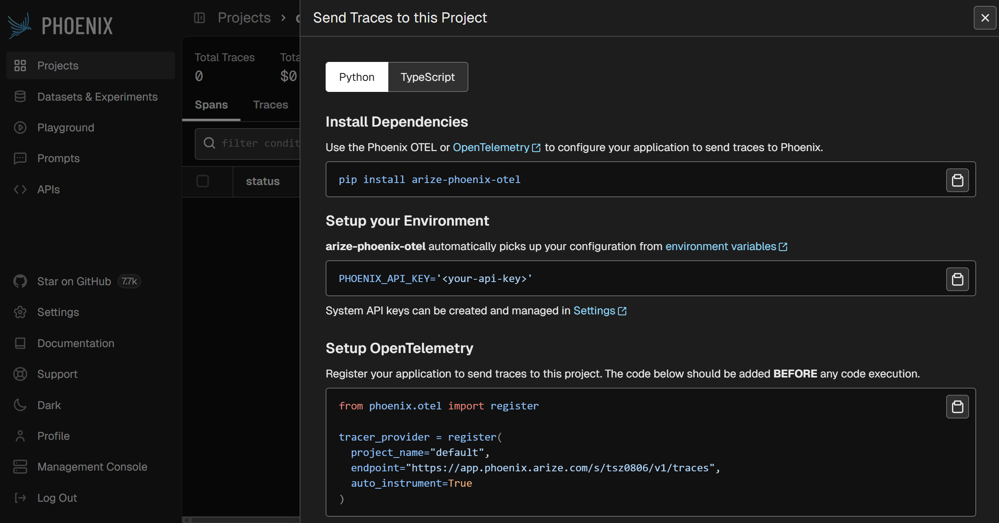
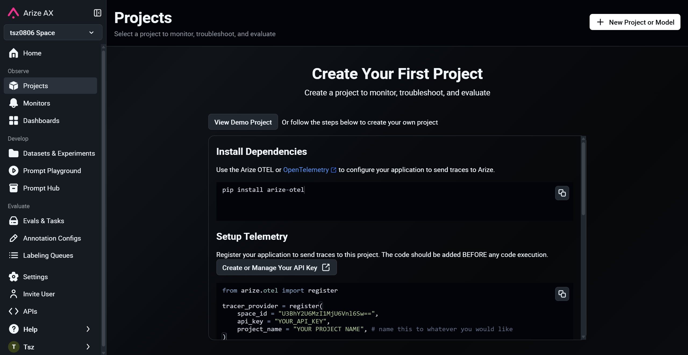
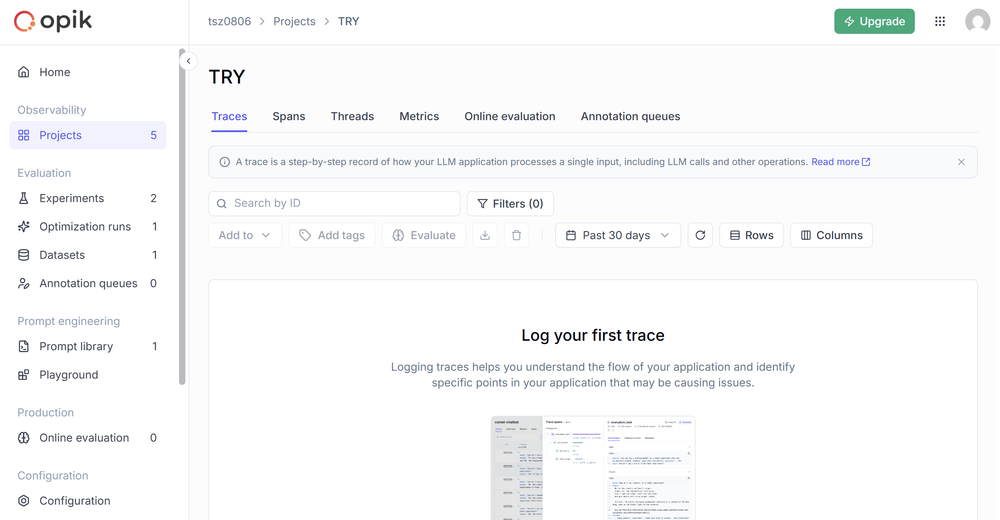

# ReversePro

---

<div align="center">

# 0️⃣ 功能更新

</div>

## ✨ 增加功能

1. 動態 Cookie：
  
  - 修改 ChatRequest 模型，增加一個 grok_cookie 欄位。
  - 在 chat 函數中，優先使用從請求傳入的 grok_cookie 來構建請求標頭。

2. Token 計算：
  
  - 引入 tiktoken 函式庫。
  - 增加 count_tokens 輔助函式。
  - 在 chat 函數中，計算 prompt_tokens。
  - 在 parse_streaming_response 函數中，累加計算 completion_tokens。
  - 在最終的 ChatResponse 中，加入 usage 物件回報 token 數量。

3. 自訂 modelMode：
  
  - 修改 ChatRequest 模型，增加一個可選的 model_mode 欄位。
  - 修改 build_payload 函式，讓它可以接收並使用傳入的 model_mode，如果沒有提供，則使用預設值。

## ✨ 一個 API，兩種身份

1.  **一個 `/v1/chat/completions` 端點**：
    *   嚴格模仿 OpenAI API。
    *   接收 OpenAI 格式的請求 (`messages` 列表)。
    *   返回 OpenAI SSE 流式格式的響應。
    *   它將使用**寫死在程式碼中**或從**環境變數**讀取的 `Cookie`（因為 Dify 的模型供應商模式無法傳遞自訂 Cookie）。
    *   這個版本為了簡化，將**不處理多輪對話**（每次都是新對話），但會**計算 Token**。

2.  **一個 `/api/chat` 端點**：
    *   使用我們自訂的 API 格式。
    *   接收包含 `message`, `conversation_id`, `grok_cookie`, `model_mode` 等自訂欄位的請求。
    *   返回我們自訂的 JSON 格式響應。
    *   它**支援多輪對話**和所有你需要的自訂功能。


<div align="center">

# 1️⃣ API 調用

</div>

## ✨ 可以直接在 Dify API Key 欄位貼上的格式：

### 1. 純 Cookie（預設使用 MODEL_MODE_AUTO）

```
share_token=aaf6c70a7ba8832ae9b09ac055cd1081947d2d897b3ca2b65d826ceeecbcf653; imgID=67e253bdd0b63c582005f9a7; i18nextLng=en; mp_ea93da913ddb66b6372b89d97b1029ac_mixpanel=%7B%22distinct_id%22%3A%2200a70e22-fed7-4713-b4c5-9b16ba9c856f%22%2C%22%24device_id%22%3A%229c284b9a-2aa5-4b8e-886e-78017fc21d9e%22%2C%22%24initial_referrer%22%3A%22https%3A%2F%2Fylsagi.com%2F%22%2C%22%24initial_referring_domain%22%3A%22ylsagi.com%22%2C%22__mps%22%3A%7B%7D%2C%22__mpso%22%3A%7B%7D%2C%22__mpus%22%3A%7B%7D%2C%22__mpa%22%3A%7B%7D%2C%22__mpu%22%3A%7B%7D%2C%22__mpr%22%3A%5B%5D%2C%22__mpap%22%3A%5B%5D%2C%22%24user_id%22%3A%2200a70e22-fed7-4713-b4c5-9b16ba9c856f%22%7D
```

### 2. 帶 cookie: 前綴（明確標示）

```
cookie:share_token=aaf6c70a7ba8832ae9b09ac055cd1081947d2d897b3ca2b65d826ceeecbcf653; imgID=67e253bdd0b63c582005f9a7; i18nextLng=en; mp_ea93da913ddb66b6372b89d97b1029ac_mixpanel=%7B%22distinct_id%22%3A%2200a70e22-fed7-4713-b4c5-9b16ba9c856f%22%2C%22%24device_id%22%3A%229c284b9a-2aa5-4b8e-886e-78017fc21d9e%22%2C%22%24initial_referrer%22%3A%22https%3A%2F%2Fylsagi.com%2F%22%2C%22%24initial_referring_domain%22%3A%22ylsagi.com%22%2C%22__mps%22%3A%7B%7D%2C%22__mpso%22%3A%7B%7D%2C%22__mpus%22%3A%7B%7D%2C%22__mpa%22%3A%7B%7D%2C%22__mpu%22%3A%7B%7D%2C%22__mpr%22%3A%5B%5D%2C%22__mpap%22%3A%5B%5D%2C%22%24user_id%22%3A%2200a70e22-fed7-4713-b4c5-9b16ba9c856f%22%7D
```

### 3. MODEL_MODE_AUTO + Cookie

```
MODEL_MODE_AUTO|share_token=aaf6c70a7ba8832ae9b09ac055cd1081947d2d897b3ca2b65d826ceeecbcf653; imgID=67e253bdd0b63c582005f9a7; i18nextLng=en; mp_ea93da913ddb66b6372b89d97b1029ac_mixpanel=%7B%22distinct_id%22%3A%2200a70e22-fed7-4713-b4c5-9b16ba9c856f%22%2C%22%24device_id%22%3A%229c284b9a-2aa5-4b8e-886e-78017fc21d9e%22%2C%22%24initial_referrer%22%3A%22https%3A%2F%2Fylsagi.com%2F%22%2C%22%24initial_referring_domain%22%3A%22ylsagi.com%22%2C%22__mps%22%3A%7B%7D%2C%22__mpso%22%3A%7B%7D%2C%22__mpus%22%3A%7B%7D%2C%22__mpa%22%3A%7B%7D%2C%22__mpu%22%3A%7B%7D%2C%22__mpr%22%3A%5B%5D%2C%22__mpap%22%3A%5B%5D%2C%22%24user_id%22%3A%2200a70e22-fed7-4713-b4c5-9b16ba9c856f%22%7D
```

### 4. MODEL_MODE_FAST + Cookie（快速模式）

```
MODEL_MODE_FAST|share_token=aaf6c70a7ba8832ae9b09ac055cd1081947d2d897b3ca2b65d826ceeecbcf653; imgID=67e253bdd0b63c582005f9a7; i18nextLng=en; mp_ea93da913ddb66b6372b89d97b1029ac_mixpanel=%7B%22distinct_id%22%3A%2200a70e22-fed7-4713-b4c5-9b16ba9c856f%22%2C%22%24device_id%22%3A%229c284b9a-2aa5-4b8e-886e-78017fc21d9e%22%2C%22%24initial_referrer%22%3A%22https%3A%2F%2Fylsagi.com%2F%22%2C%22%24initial_referring_domain%22%3A%22ylsagi.com%22%2C%22__mps%22%3A%7B%7D%2C%22__mpso%22%3A%7B%7D%2C%22__mpus%22%3A%7B%7D%2C%22__mpa%22%3A%7B%7D%2C%22__mpu%22%3A%7B%7D%2C%22__mpr%22%3A%5B%5D%2C%22__mpap%22%3A%5B%5D%2C%22%24user_id%22%3A%2200a70e22-fed7-4713-b4c5-9b16ba9c856f%22%7D 9J5BD7KKYM#NXPfvaytn3Qu
```

### 5. MODEL_MODE_ACCURATE + Cookie（精確模式）

```
MODEL_MODE_ACCURATE|share_token=aaf6c70a7ba8832ae9b09ac055cd1081947d2d897b3ca2b65d826ceeecbcf653; imgID=67e253bdd0b63c582005f9a7; i18nextLng=en; mp_ea93da913ddb66b6372b89d97b1029ac_mixpanel=%7B%22distinct_id%22%3A%2200a70e22-fed7-4713-b4c5-9b16ba9c856f%22%2C%22%24device_id%22%3A%229c284b9a-2aa5-4b8e-886e-78017fc21d9e%22%2C%22%24initial_referrer%22%3A%22https%3A%2F%2Fylsagi.com%2F%22%2C%22%24initial_referring_domain%22%3A%22ylsagi.com%22%2C%22__mps%22%3A%7B%7D%2C%22__mpso%22%3A%7B%7D%2C%22__mpus%22%3A%7B%7D%2C%22__mpa%22%3A%7B%7D%2C%22__mpu%22%3A%7B%7D%2C%22__mpr%22%3A%5B%5D%2C%22__mpap%22%3A%5B%5D%2C%22%24user_id%22%3A%2200a70e22-fed7-4713-b4c5-9b16ba9c856f%22%7D 9J5BD7KKYM#NXPfvaytn3Qu WPQE5X1BNM#HpGi3DKT7FN3
```

### 6. MODEL_MODE_REASONING + Cookie（推理模式）

```
MODEL_MODE_REASONING|share_token=aaf6c70a7ba8832ae9b09ac055cd1081947d2d897b3ca2b65d826ceeecbcf653; imgID=67e253bdd0b63c582005f9a7; i18nextLng=en; mp_ea93da913ddb66b6372b89d97b1029ac_mixpanel=%7B%22distinct_id%22%3A%2200a70e22-fed7-4713-b4c5-9b16ba9c856f%22%2C%22%24device_id%22%3A%229c284b9a-2aa5-4b8e-886e-78017fc21d9e%22%2C%22%24initial_referrer%22%3A%22https%3A%2F%2Fylsagi.com%2F%22%2C%22%24initial_referring_domain%22%3A%22ylsagi.com%22%2C%22__mps%22%3A%7B%7D%2C%22__mpso%22%3A%7B%7D%2C%22__mpus%22%3A%7B%7D%2C%22__mpa%22%3A%7B%7D%2C%22__mpu%22%3A%7B%7D%2C%22__mpr%22%3A%5B%5D%2C%22__mpap%22%3A%5B%5D%2C%22%24user_id%22%3A%2200a70e22-fed7-4713-b4c5-9b16ba9c856f%22%7D
```
### 在 Dify 中的設定步驟：

1. 進入「設定」→「模型供應商」→「自定義」
2. 填寫：
   - **API Base URL**: `http://你的伺服器:5000/v1`
   - **API Key**: 貼上上面任一格式
   - **模型名稱**: `grok-3` 或 `grok-2` 或 `grok-1`
3. 儲存並測試

<div align="center">

# 2️⃣ Dify 配置（HTTP版）

</div>

在 Dify 中使用 HTTP Request 節點來調用這個 API，以下是詳細的設置步驟：

## 1. **創建新的工作流程**
- 進入 Dify → 工作室 → 創建空白工作流程

## 2. **添加 HTTP Request 節點**
- 從左側節點列表拖入「HTTP Request」節點

## 3. **配置 HTTP Request 節點**

### **基本配置：**

```yaml
方法 (Method): POST

URL: http://你的伺服器IP:5000/api/chat

Headers:
  Content-Type: application/json

Body 類型: JSON
```

### **Body 內容（原生 API 格式）：**

**選項 1：簡單請求（新對話）**
```json
{
  "message": "{{#1734933043821.text#}}",
  "model": "grok-3",
  "model_mode": "MODEL_MODE_AUTO",
  "cookie": "share_token=aaf6c70a7ba8832ae9b09ac055cd1081947d2d897b3ca2b65d826ceeecbcf653; imgID=67e253bdd0b63c582005f9a7; i18nextLng=en; mp_ea93da913ddb66b6372b89d97b1029ac_mixpanel=%7B%22distinct_id%22%3A%2200a70e22-fed7-4713-b4c5-9b16ba9c856f%22%2C%22%24device_id%22%3A%229c284b9a-2aa5-4b8e-886e-78017fc21d9e%22%2C%22%24initial_referrer%22%3A%22https%3A%2F%2Fylsagi.com%2F%22%2C%22%24initial_referring_domain%22%3A%22ylsagi.com%22%2C%22__mps%22%3A%7B%7D%2C%22__mpso%22%3A%7B%7D%2C%22__mpus%22%3A%7B%7D%2C%22__mpa%22%3A%7B%7D%2C%22__mpu%22%3A%7B%7D%2C%22__mpr%22%3A%5B%5D%2C%22__mpap%22%3A%5B%5D%2C%22%24user_id%22%3A%2200a70e22-fed7-4713-b4c5-9b16ba9c856f%22%7D"
}
```

**選項 2：使用變數管理 Cookie（推薦）**
```json
{
  "message": "{{#1734933043821.text#}}",
  "model": "{{model}}",
  "model_mode": "{{model_mode}}",
  "cookie": "{{grok_cookie}}"
}
```

**選項 3：繼續對話（需要保存對話 ID）**
```json
{
  "message": "{{#1734933043821.text#}}",
  "model": "grok-3",
  "model_mode": "MODEL_MODE_AUTO",
  "conversation_id": "{{conversation_id}}",
  "parent_response_id": "{{response_id}}",
  "cookie": "share_token=aaf6c70a7ba8832ae9b09ac055cd1081947d2d897b3ca2b65d826ceeecbcf653; imgID=67e253bdd0b63c582005f9a7; i18nextLng=en; mp_ea93da913ddb66b6372b89d97b1029ac_mixpanel=%7B%22distinct_id%22%3A%2200a70e22-fed7-4713-b4c5-9b16ba9c856f%22%2C%22%24device_id%22%3A%229c284b9a-2aa5-4b8e-886e-78017fc21d9e%22%2C%22%24initial_referrer%22%3A%22https%3A%2F%2Fylsagi.com%2F%22%2C%22%24initial_referring_domain%22%3A%22ylsagi.com%22%2C%22__mps%22%3A%7B%7D%2C%22__mpso%22%3A%7B%7D%2C%22__mpus%22%3A%7B%7D%2C%22__mpa%22%3A%7B%7D%2C%22__mpu%22%3A%7B%7D%2C%22__mpr%22%3A%5B%5D%2C%22__mpap%22%3A%5B%5D%2C%22%24user_id%22%3A%2200a70e22-fed7-4713-b4c5-9b16ba9c856f%22%7D"
}
```

## 4. **設置變數（如果使用選項 2）**

在工作流程的「變數」區塊添加：

```yaml
變數名稱: grok_cookie
變數類型: 字串
預設值: [貼上你的完整 cookie]

變數名稱: model
變數類型: 字串
預設值: grok-3

變數名稱: model_mode
變數類型: 字串
預設值: MODEL_MODE_AUTO
```

## 5. **處理回應（可維持原狀即可）**

添加「代碼執行」節點來解析回應：

```python
import json

def main(http_response):
    # 解析 HTTP 回應
    response = json.loads(http_response)
    
    if response.get("success"):
        data = response.get("data", {})
        return {
            "answer": data.get("response", ""),
            "conversation_id": data.get("conversation_id", ""),
            "response_id": data.get("response_id", ""),
            "tokens": data.get("token_usage", {})
        }
    else:
        return {
            "error": response.get("error", "Unknown error")
        }
```

## ⚠️ 注意事項

1. **URL 格式**：確保 URL 是 `http://你的IP:5000/api/chat`（原生 API）
2. **變數引用**：`{{#節點ID.欄位#}}` 格式，節點 ID 會自動生成
3. **Cookie 長度**：Cookie 很長，確保完整複製
4. **超時設置**：可以在 HTTP Request 節點設置超時時間（建議 60 秒）


<div align="center">

# 3️⃣ 監控

</div>

## langfuse

> https://cloud.langfuse.com

## langsmith

> https://api.smith.langchain.com


## Pheonix

> https://app.phoenix.arize.com/s/tsz0806/v1/traces



## Arize AI

> https://drive.proton.me/urls/




## Opik

> https://www.comet.com/opik/api/


